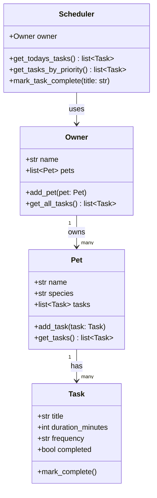

# PawPal+ Implementation Plan

## System Overview

Four classes in `pawpal_system.py`:

- **Task** — a single care activity (description, time, frequency, completion status)
- **Pet** — stores pet details and owns a list of tasks
- **Owner** — manages multiple pets and provides access to all their tasks
- **Scheduler** — the "brain" that retrieves, organizes, and manages tasks across pets

---

## Phase 1 — UML Class Diagram (Mermaid.js)

**Relationships:**
- Owner **has** one or more Pets
- Pet **has** one or more Tasks
- Scheduler **uses** an Owner to access all pets and their tasks

---

## Phase 2 — Class Stubs → Implementation (`pawpal_system.py`)

**To-Do:**
- [ ] Create `pawpal_system.py`
- [ ] `Task(title, duration_minutes, frequency="daily")`
  - Attributes: `title`, `duration_minutes`, `frequency`, `completed = False`
  - Method: `mark_complete()` sets `completed = True`
- [ ] `Pet(name, species)`
  - Attributes: `name`, `species`, `tasks = []`
  - Method: `add_task(task)` appends to `tasks`
  - Method: `get_tasks()` returns task list
- [ ] `Owner(name)`
  - Attributes: `name`, `pets = []`
  - Method: `add_pet(pet)` appends to `pets`
  - Method: `get_all_tasks()` returns all tasks across all pets
- [ ] `Scheduler(owner)`
  - Attribute: `owner`
  - Method: `get_todays_tasks()` returns all incomplete tasks
  - Method: `get_tasks_by_priority()` returns tasks sorted (daily first, longer tasks first)
  - Method: `mark_task_complete(title)` finds and marks a task by name

---

## Phase 3 — Demo Script (`main.py`)

Create `main.py` as a terminal demo:

**Script should:**
1. Import classes from `pawpal_system`
2. Create one `Owner`
3. Create at least two `Pet` objects, add them to the owner
4. Add at least three `Task` objects (with different durations) to the pets
5. Create a `Scheduler` and call `get_todays_tasks()`
6. Print a "Today's Schedule" summary to the terminal

**Run with:** `python main.py`

---

## Phase 4 — Tests (`tests/test_pawpal.py`)

**To-Do:**
- [ ] Create `tests/` directory and `tests/test_pawpal.py`
- [ ] Test 1: `mark_complete()` changes task's `completed` to `True`
- [ ] Test 2: Adding a task to a `Pet` increases its task count

**Run with:** `python -m pytest` or `pytest`

---

## Phase 5 — Connect to Streamlit UI (`app.py`)

**To-Do:**
- [ ] Import `Owner`, `Pet`, `Task`, `Scheduler` from `pawpal_system`
- [ ] Build objects from UI inputs on "Generate schedule" click
- [ ] Display scheduled tasks with duration and status
- [ ] Show which tasks are complete vs pending
- [ ] Remove placeholder warning content

---

## Phase 6 — Reflect (`reflection.md`)

- [ ] Update UML diagram to match final implementation
- [ ] Fill in all sections of `reflection.md`

---

## Verification Checklist

- [ ] `python main.py` prints a readable "Today's Schedule"
- [ ] `pytest` — both tests pass
- [ ] `streamlit run app.py` — full flow works end-to-end
