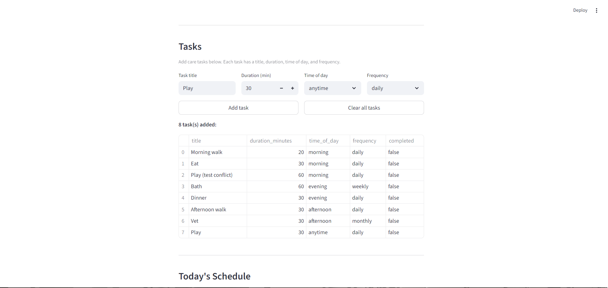
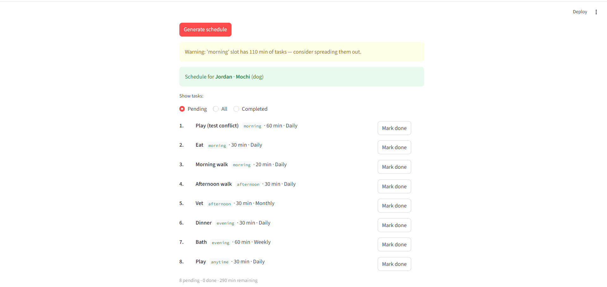

# 🐾 PawPal+

A Streamlit app that helps a pet owner build and manage a daily care schedule for their pet.

---

## Setup

```bash
python -m venv .venv
.venv\Scripts\activate        # Windows
# source .venv/bin/activate   # Mac/Linux
pip install -r requirements.txt
streamlit run app.py
```

---

## How it works

1. Enter your name and your pet's name and species.
2. Add care tasks — each task has a title, duration, time of day, and frequency.
3. Click **Generate schedule** to see tasks sorted chronologically (morning first).
4. Any scheduling conflicts (overloaded time slots, duplicate tasks) appear as warnings above the schedule.
5. Use the filter radio to toggle between pending, completed, and all tasks.

Recurring tasks (daily or weekly) automatically renew when marked complete.

---

## Files

| File | Purpose |
|---|---|
| `app.py` | Streamlit UI |
| `pawpal_system.py` | Core classes: Task, Pet, Owner, Scheduler |
| `main.py` | Terminal demo |
| `tests/test_pawpal.py` | pytest test suite (9 tests) |
| `uml.md` | Mermaid.js class diagram |

---

## Tests

```bash
python -m pytest tests/ -v
```

---

## 📸 Demo




