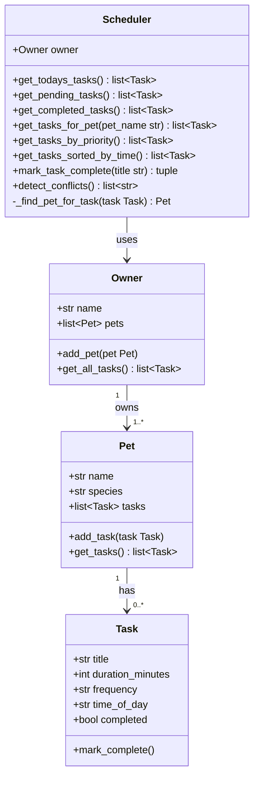

# PawPal+ — Class Diagram

```mermaid
classDiagram
    class Task {
        +str title
        +int duration_minutes
        +str frequency
        +str time_of_day
        +bool completed
        +mark_complete()
    }

    class Pet {
        +str name
        +str species
        +list~Task~ tasks
        +add_task(task Task)
        +get_tasks() list~Task~
    }

    class Owner {
        +str name
        +list~Pet~ pets
        +add_pet(pet Pet)
        +get_all_tasks() list~Task~
    }

    class Scheduler {
        +Owner owner
        +get_todays_tasks() list~Task~
        +get_pending_tasks() list~Task~
        +get_completed_tasks() list~Task~
        +get_tasks_for_pet(pet_name str) list~Task~
        +get_tasks_by_priority() list~Task~
        +get_tasks_sorted_by_time() list~Task~
        +mark_task_complete(title str) tuple
        +detect_conflicts() list~str~
        -_find_pet_for_task(task Task) Pet
    }

    Owner "1" --> "1..*" Pet : owns
    Pet "1" --> "0..*" Task : has
    Scheduler --> Owner : uses
```
